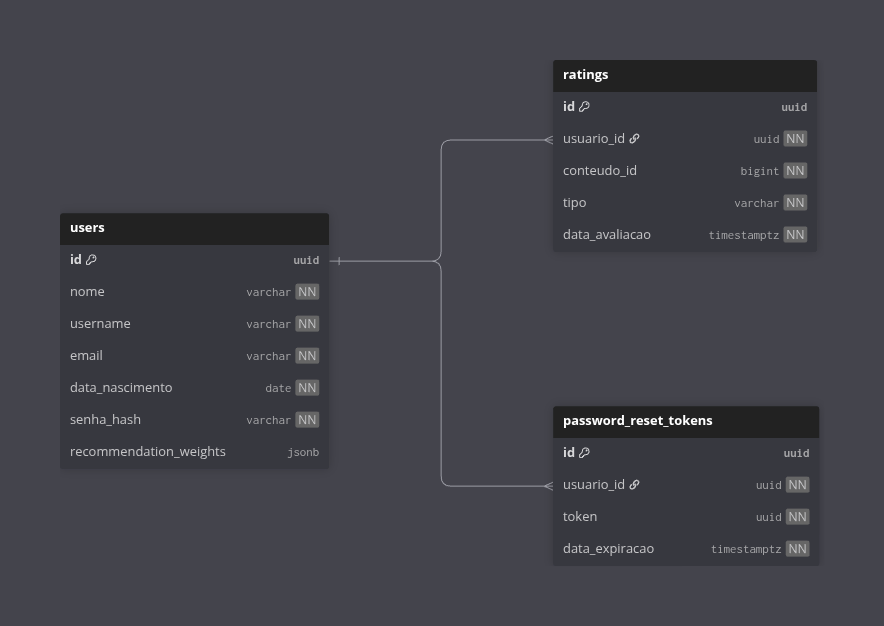

# Rekomenda API

REST + WebSocket API for personalized and collaborative film recommendations, powered by Gemini AI and TMDB.
This project was developed as part of the Software Analysis and Design Project course at UEPA, under the guidance of Professor Anderson Costa.
To learn more about the project's conceptualization and the methodologies applied, visit: https://gamma.app/docs/REKOMENDA-i5669qqb0jky9vi

## Stack

| Layer | Technology |
|---|---|
| Runtime | Java 25/Spring Boot 4 |
| Persistence | PostgreSQL 17 + Flyway |
| Cache/State | Redis 7 |
| AI | Google Vertex AI (Gemini 2.0 Flash) via Spring AI |
| Film data | TMDB REST API |
| Auth | JWT (stateless) + Spring Security 7 |
| Real-time | WebSockets (STOMP over SockJS) |
| Docs | Springdoc OpenAPI (Swagger UI) |

## Architecture

```
com.rekomenda.api
├── config/          # Spring beans: Security, JWT, Redis, WebSocket, OpenAPI, Scheduler
├── domain/
│   ├── auth/        # Register, login, password recovery (JWT issued here)
│   ├── user/        # Profile management; recommendation weight vector (JSONB)
│   ├── rating/      # Like/dislike/skip content; recalculates genre weights
│   ├── recommendation/ # Personal film feed built from genre weights x TMDB
│   ├── chat/        # Single-user AI chat -> Gemini extracts intent -> TMDB results
│   └── room/        # Collaborative rooms: REST lifecycle + STOMP real-time events
├── infrastructure/
│   ├── ai/          # GeminiService: keyword/genre extraction via Spring AI ChatClient
│   ├── tmdb/        # TmdbClient: movie search/detail via RestClient
│   └── mail/        # MailService: password-reset e-mails via JavaMailSender
└── shared/
    ├── exception/   # GlobalExceptionHandler, BusinessException, ErrorResponse
    └── security/    # JwtService, JwtAuthFilter, JwtChannelInterceptor, UserDetailsServiceImpl
```

### System overview

- **Clients**: Web/mobile frontends call the API via HTTP and connect to rooms via WebSocket/STOMP.
- **API layer**: Spring MVC controllers under `/api/**` plus the `/ws` WebSocket endpoint; all requests pass through Spring Security with JWT.
- **Domain layer**: Services in `auth`, `user`, `rating`, `recommendation`, `chat`, and `room` orchestrate business logic and I/O.
- **Infrastructure**:
  - PostgreSQL 17 stores users, ratings and password reset tokens.
  - Redis 7 stores JWT blacklist entries and in-memory room state with TTL.
  - TMDB provides movie metadata; Gemini (Vertex AI) interprets prompts; SMTP sends password reset e-mails.

### Key design decisions

- **Domain-centric packaging**: each domain owns its entity, repository, service, controller, and DTOs.
- **Stateless auth**: JWTs validated on every request; revoked tokens stored in Redis with TTL matching token expiry.
- **Recommendation weights**: each user holds a 'Map<genreId, score>' JSONB column updated incrementally on every rating; no batch job needed.
- **Rooms in Redis**: collaborative rooms are ephemeral (30-minute TTL); 'RoomCleanupScheduler' sweeps expired ones and broadcasts a 'ROOM_EXPIRED' STOMP event.
- **Host dropout handling**: 'RoomSessionEventListener' listens for WebSocket 'SessionDisconnectEvent' and closes the room if the host disconnects.

## API surface

| Prefix | Protocol | Description |
|---|---|---|
| `/api/auth/**` | REST | Register, login, logout, password recovery |
| `/api/users/me` | REST | Profile read/update |
| `/api/ratings` | REST | Rate content; view history |
| `/api/recommendations` | REST | Personalised film feed |
| `/api/chat/individual` | REST | Single-user AI recommendation chat |
| `/api/movies/{id}` | REST | Movie detail by TMDB ID (Redis-cached, TTL 7 days) |
| `/api/rooms/**` | REST | Create/join/inspect rooms |
| `/ws` | WebSocket (STOMP) | Room real-time events |
| `/swagger-ui.html` | HTTP | Interactive API docs |

### WebSocket message flow

```
Client -> /app/room.{roomId}.join            -> broadcasts RoomEvent(PARTICIPANT_JOINED)
Client -> /app/room.{roomId}.submit-prompt   -> triggers Gemini + TMDB, broadcasts FILMS_SUGGESTED
Client -> /app/room.{roomId}.choose-film     -> broadcasts FILM_CHOSEN
Client -> /app/room.{roomId}.leave/kick/close/more-recommendations
Server -> /topic/room.{roomId}               -> all room events
```

## Running locally

### Prerequisites

- Docker + Docker Compose
- A '.env' file (copy from '.env.example' and fill in secrets)

```bash
cp .env.example .env
# edit .env with your TMDB key, Vertex AI project, SMTP credentials, JWT secret
docker compose up --build
```

The API will be available at `http://localhost:8080`.
Swagger UI: `http://localhost:8080/swagger-ui.html`

## Database modelling

### PostgreSQL: entity-relationship overview



> `recommendation_weights` is a JSONB column storing `{ "tmdbGenreId": score }` pairs (e.g. `{"28": 3.5, "12": -1.0}`). It is updated incrementally on every rating: no batch recalculation needed.

> `ratings.tipo` is an enum: `GOSTEI (+2)`, `INTERESSANTE (+1)`, `NEUTRO (0)`, `NAO_INTERESSANTE (−1)`, `NAO_GOSTEI (−2)`. The numeric delta is applied to each genre weight of the rated film.

### Redis: key schema

| Key pattern | Type | TTL | Description |
|---|---|---|---|
| `jwt:blacklist:{jti}` | String | Remaining token lifetime | Revoked JWT: presence means "deny this token" |
| `room:{roomId}` | String (JSON) | 30 min | Full `Room` object including participants and suggested films |
| `tmdb:movie:{tmdbId}` | String (JSON) | 7 days (configurable via `TMDB_MOVIE_CACHE_TTL_DAYS`) | Cached `TmdbMovie` — avoids redundant TMDB API calls for movie detail lookups |
| `rec:dashboard:{userId}` | String (JSON) | 5 min (configurable via `RECOMMENDATION_DASHBOARD_CACHE_TTL_MINUTES`) | Cached personalised dashboard — invalidated automatically when the user rates a movie |

**Usage:**
- `JwtService` writes `jwt:blacklist:{jti}` on logout; `JwtAuthFilter` checks existence on each request.
- `RoomService` stores and reads `room:{roomId}` whenever a room changes.
- `RoomCleanupScheduler` scans `room:*` keys periodically to expire old rooms.

## Database migrations

Flyway runs automatically on startup. Migration scripts live in `src/main/resources/db/migration/`:

## CI/CD

Every push to 'main' triggers '.github/workflows/release.yml':

1. Builds a fat JAR ('mvnw package -DskipTests').
2. Computes a date-based version ('YYYYMMDD-N').
3. Creates a GitHub Release with the JAR as an artifact.
